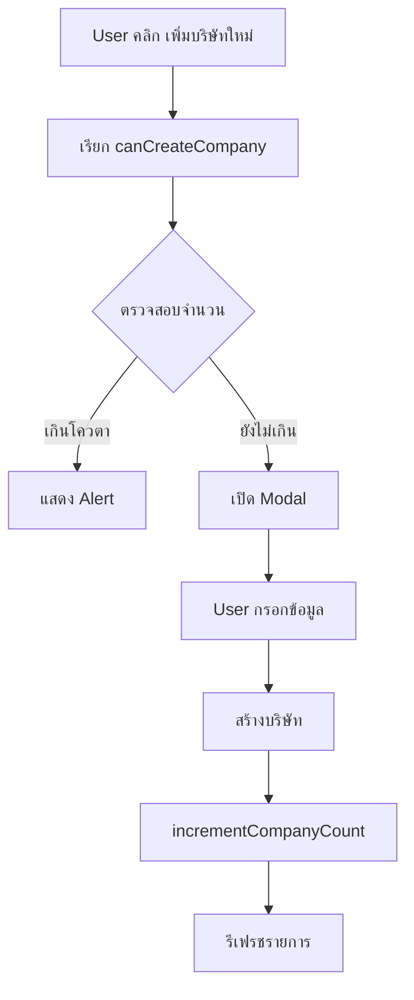

# 🏢 คู่มือจำกัดจำนวนองค์กรตาม Quota

## 📋 ภาพรวม

ระบบได้เพิ่มการตรวจสอบจำนวนองค์กรที่ user สามารถสร้างได้ตามแผนการใช้งาน (Subscription Plan) เพื่อให้สอดคล้องกับโมเดลธุรกิจ

## 🎯 จำนวนองค์กรที่สร้างได้ตามแผน

| แผน | จำนวนองค์กรสูงสุด | ราคา |
|-----|-------------------|------|
| **Free** | 1 องค์กร | ฟรี |
| **Basic** | 3 องค์กร | 299 บาท/เดือน |
| **Premium** | 10 องค์กร | 999 บาท/เดือน |
| **Enterprise** | ไม่จำกัด | 2,999 บาท/เดือน |

## 🔧 การทำงาน

### 1. เมื่อ User คลิกปุ่ม "เพิ่มบริษัทใหม่"

ระบบจะ:
1. ตรวจสอบจำนวนบริษัทที่ user สร้างไว้แล้ว
2. ดึงข้อมูล quota จากบริษัทแรก
3. เปรียบเทียบกับ `maxCompanies` ในแผนปัจจุบัน
4. ถ้าเกินโควตา → แสดง alert แจ้งเตือน
5. ถ้ายังไม่เกิน → เปิด modal สร้างบริษัทใหม่

### 2. ข้อความแจ้งเตือนเมื่อเกินโควตา

**Free Plan:**
```
Free Plan สามารถสร้างได้แค่ 1 องค์กร 
กรุณาอัปเกรดแผนเพื่อสร้างองค์กรเพิ่มเติม
```

**Basic Plan:**
```
แผน BASIC สามารถสร้างได้สูงสุด 3 องค์กร (ปัจจุบันมี 3 องค์กร) 
กรุณาอัปเกรดแผนเพื่อสร้างองค์กรเพิ่มเติม
```

### 3. แสดงข้อมูลใน Modal

เมื่อเปิด modal สร้างบริษัท จะแสดงข้อมูล:
```
แผน FREE: สร้างได้ 0/1 องค์กร
```

## 📊 โครงสร้างข้อมูล

### CompanyQuota Interface

```typescript
export interface CompanyQuota {
    // ... fields อื่นๆ
    
    // ⭐ ฟิลด์ใหม่
    maxCompanies: number;        // จำนวนองค์กรสูงสุด (-1 = ไม่จำกัด)
    currentCompanies: number;    // จำนวนองค์กรปัจจุบัน
}
```

## 🔌 API Functions

### `canCreateCompany(userId: string)`

ตรวจสอบว่า user สามารถสร้างบริษัทใหม่ได้หรือไม่

**Parameters:**
- `userId` - Firebase Auth UID

**Returns:**
```typescript
{
    canCreate: boolean;      // สามารถสร้างได้หรือไม่
    reason?: string;         // เหตุผลถ้าสร้างไม่ได้
    currentCount: number;    // จำนวนบริษัทปัจจุบัน
    maxCount: number;        // จำนวนสูงสุด (-1 = ไม่จำกัด)
    plan?: string;           // แผนปัจจุบัน
}
```

**ตัวอย่างการใช้งาน:**

```typescript
import { canCreateCompany } from '../services/quota';
import { auth } from '../firebase.config';

const handleOpenCreateModal = async () => {
    const currentUser = auth.currentUser;
    if (!currentUser) return;

    const result = await canCreateCompany(currentUser.uid);
    
    if (!result.canCreate) {
        alert(result.reason);
        return;
    }

    // เปิด modal สร้างบริษัท
    setShowCreateModal(true);
};
```

### `incrementCompanyCount(companyId: string)`

เพิ่มจำนวนบริษัทปัจจุบันใน quota (ใช้เมื่อสร้างบริษัทสำเร็จ)

**Parameters:**
- `companyId` - ID ของบริษัท

**ตัวอย่าง:**
```typescript
await incrementCompanyCount(newCompanyId);
```

### `decrementCompanyCount(companyId: string)`

ลดจำนวนบริษัทปัจจุบันใน quota (ใช้เมื่อลบบริษัท)

**Parameters:**
- `companyId` - ID ของบริษัท

**ตัวอย่าง:**
```typescript
await decrementCompanyCount(deletedCompanyId);
```

## 🎨 UI/UX

### ปุ่ม "เพิ่มบริษัทใหม่"

```tsx
<button onClick={handleOpenCreateModal}>
    เพิ่มบริษัทใหม่
</button>
```

### Modal แสดงข้อมูล Quota

```tsx
{quotaInfo && (
    <div className="p-3 bg-blue-50 border border-blue-200 rounded-md">
        <p className="text-sm text-blue-800">
            <span className="font-medium">
                แผน {quotaInfo.plan.toUpperCase()}:
            </span>
            {' '}สร้างได้ {quotaInfo.currentCount}/{quotaInfo.maxCount === -1 ? '∞' : quotaInfo.maxCount} องค์กร
        </p>
    </div>
)}
```

## 🔄 Flow การสร้างบริษัท



## 🧪 การทดสอบ

### Test Case 1: Free Plan - สร้างบริษัทแรก
```
✅ Expected: สามารถสร้างได้
```

### Test Case 2: Free Plan - สร้างบริษัทที่ 2
```
❌ Expected: แสดง alert "Free Plan สามารถสร้างได้แค่ 1 องค์กร"
```

### Test Case 3: Basic Plan - สร้างบริษัทที่ 4
```
❌ Expected: แสดง alert "แผน BASIC สามารถสร้างได้สูงสุด 3 องค์กร"
```

### Test Case 4: Enterprise Plan - สร้างบริษัทที่ 100
```
✅ Expected: สามารถสร้างได้ (ไม่จำกัด)
```

## 📝 Migration สำหรับ Quota เดิม

ถ้ามี quota เดิมที่ยังไม่มี field `maxCompanies` และ `currentCompanies`:

### วิธีที่ 1: ใช้ HTML Script

เปิด `scripts/auto-create-quota.html` และรีเฟรช quota ทั้งหมด

### วิธีที่ 2: Update Manual ใน Firestore

```javascript
// Update quota เดิมให้มี field ใหม่
await updateDoc(doc(db, 'companyQuotas', companyId), {
    maxCompanies: 1,      // ตามแผน
    currentCompanies: 0,  // นับจากจำนวนบริษัทจริง
    updatedAt: Timestamp.now()
});
```

### วิธีที่ 3: ใช้ Default Value

ระบบจะใช้ default value อัตโนมัติ:
```typescript
maxCompanies: data.maxCompanies ?? 1,
currentCompanies: data.currentCompanies ?? 0,
```

## 🚨 ข้อควรระวัง

1. **ต้องมี quota** - ทุกบริษัทต้องมี quota document ใน `companyQuotas` collection
2. **Document ID** - quota document ID ต้องตรงกับ company ID
3. **การนับ currentCompanies** - ควรนับจากจำนวนบริษัทจริงที่ user สร้าง
4. **การลบบริษัท** - ต้อง call `decrementCompanyCount()` ด้วย

## 🔗 ไฟล์ที่เกี่ยวข้อง

- `types.ts` - เพิ่ม `maxCompanies` และ `currentCompanies` ใน `CompanyQuota`
- `services/quota.ts` - เพิ่มฟังก์ชัน `canCreateCompany`, `incrementCompanyCount`, `decrementCompanyCount`
- `components/CompanySelector.tsx` - เพิ่มการตรวจสอบก่อนเปิด modal
- `scripts/auto-create-quota.html` - อัปเดต default quota
- `scripts/create-quota-for-company.html` - อัปเดต quota templates

## ✅ สรุป

ระบบตอนนี้:
- ✅ ตรวจสอบจำนวนองค์กรก่อนสร้าง
- ✅ แสดง alert เมื่อเกินโควตา
- ✅ แสดงข้อมูล quota ใน modal
- ✅ รองรับทุกแผนการใช้งาน (Free, Basic, Premium, Enterprise)
- ✅ มี API สำหรับจัดการจำนวนองค์กร

**Free Plan ตอนนี้สร้างได้แค่ 1 องค์กรเท่านั้น** ตามที่กำหนดไว้! 🎉

